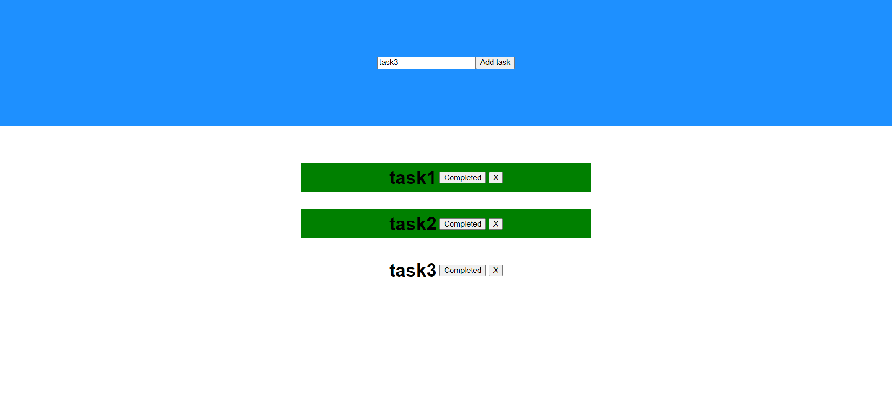
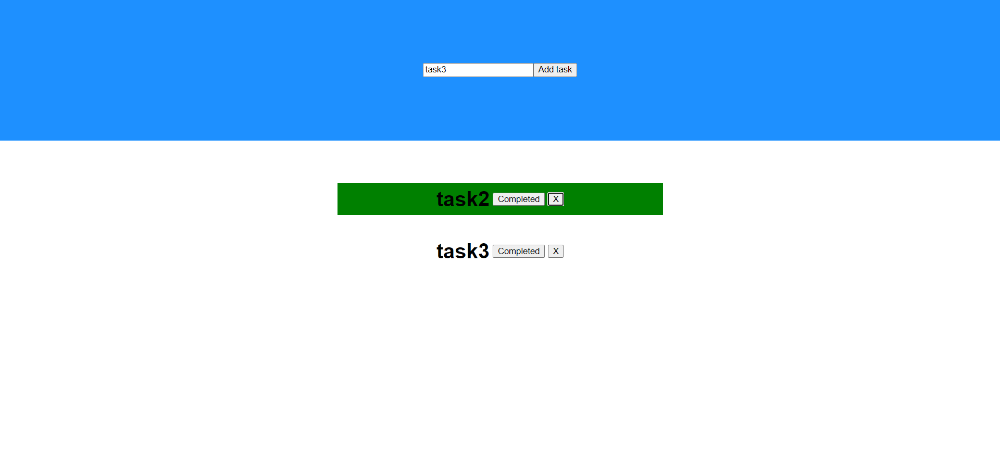

# ToDoList with React

This project is a part of PedroTech's ReactJs Course

## Table of contents

- [Overview](#overview)
  - [The objective](#the-objective)
  - [Screenshot](#screenshot)
  - [Links](#links)
- [My process](#my-process)
  - [Built with](#built-with)
  - [What I learned](#what-i-learned)
  - [Continued development](#continued-development)
  - [Useful resources](#useful-resources)
- [Author](#author)

## Overview

### The Objective

To learn and Strengthen the concepts of States and components in React.

### Screenshot

  

### Links

- Solution URL: [Solution URL](https://github.com/AshwanthramKL/toDoList-react)
- Live Site URL: [Landing Page](https://ashwanthramkl.github.io/Huddle-landing-page/)

## My process

### Built with

- React
- Cascading Style Sheets

### What I learned

This project helped me strenghten my understanding some concepts such as

- States
- Components
- Spread Operator
- filter()

### Useful resources

- [React docs](https://react.dev/)
- [PedroTech's React Playlist](https://youtube.com/playlist?list=PLpPqplz6dKxW5ZfERUPoYTtNUNvrEebAR)

## Author

- Website - [MARTIALEAGLE](https://github.com/AshwanthramKL)
- Frontend Mentor - [@AshwanthramKL](https://www.frontendmentor.io/profile/AshwanthramKL)
- Twitter - [@AshwanthramKL](https://www.twitter.com/AshwanthramKL)
